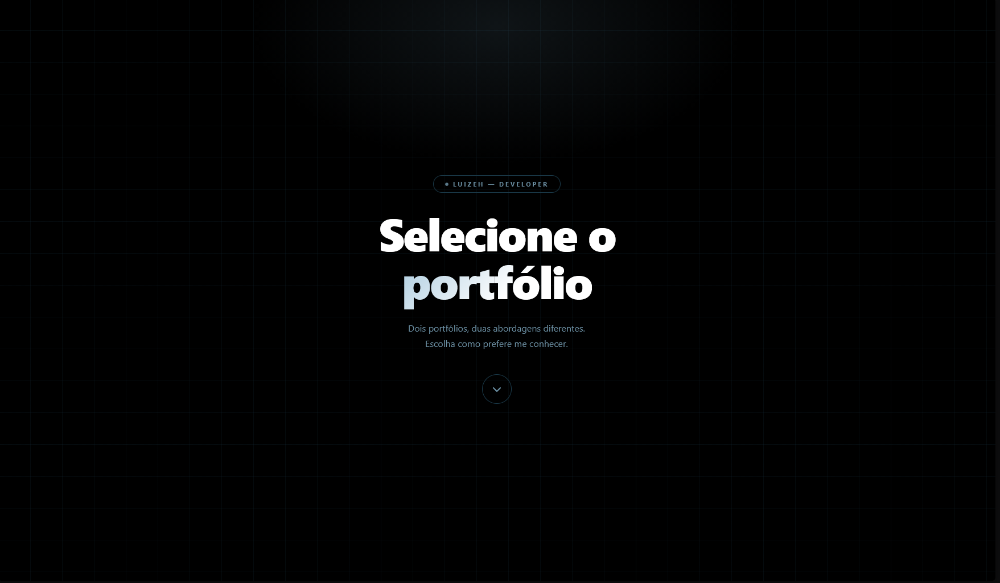

# selection

### um portal entre dois mundos

---

## sobre

**selection** é um website estilizado criado para redirecionar visitantes para duas experiências diferentes de portfólio.

a ideia do projeto é simples:

ao invés de mostrar apenas um único portfólio, o website cria uma *tela de seleção*, onde o usuário escolhe entre:

- 🛠️ um portfólio feito 100% por mim
- 🤖 um portfólio auxiliado por inteligência artificial

cada seção possui sua própria identidade visual, atmosfera e propósito.

---

## preview

---

## seções

### 🛠️ portfolio handmade

um portfólio construído inteiramente por mim, sem código ou estrutura gerada por IA.

focado em:
- desenvolvimento front-end
- estudos pessoais
- implementação pura
- design e lógica feitos manualmente

---

### 🤖 portfolio com IA

um portfólio focado em projetos, conceitos e criações desenvolvidas com o suporte de inteligência artificial.

inclui:
- experimentos
- conceitos criativos
- desenvolvimento assistido
- fluxos de trabalho integrados com IA

---

## tecnologias

---

## objetivo

este repositório existe para criar uma experiência de navegação mais limpa e imersiva entre os dois portfólios.

ao invés de separar tudo em links aleatórios, o **selection** funciona como um hub central.

---

## acesso

> clique em **portfolio** no README principal do meu perfil para acessar a página de seleção.

---

### "escolha seu caminho."

